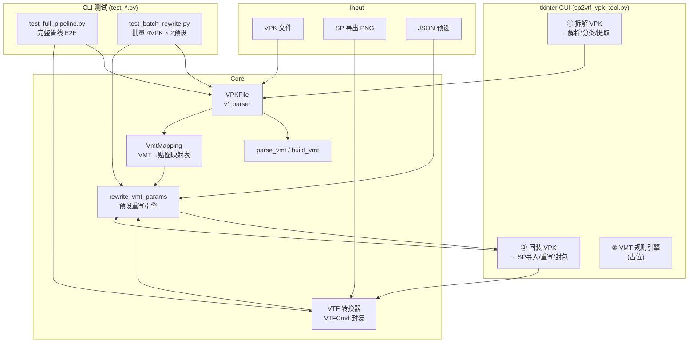
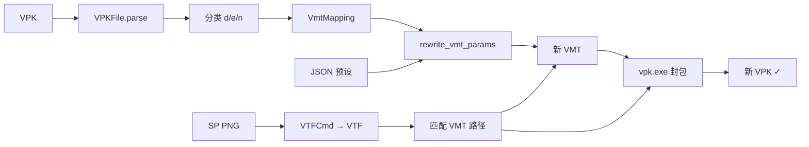

# SP2VTF VPK 工具 — 架构文档

## 项目定位

本工具是 SP2VTF 生态的 VPK 拆装器，与上游项目互补：

| 项目 | 作者 | 定位 |
|------|------|------|
| [SP2VTF](https://github.com/ora233-fantaea/SP2VTF) | ora233-fantaea | Substance Painter → VTF 单张贴图转换 (PyQt6 GUI) |
| `E:\left4dead2\vmt_tools\` | 一个橘色的橙子 | 批量 VMT 重写脚本 (sfm2sfm/sf2ems) |
| **本工具 (橙子)** | 一个橘色的橙子 | VPK 拆解 + 贴图分类 + JSON 驱动 VMT 重写 + 封包一体化 |

---

## 架构总览 (UML)



### 数据流



---

## 核心模块

### VPKFile — VPK v1 解析器

- 解析头结构 `0x55AA1234` + 目录树 + 预加载数据 + 文件数据
- 目录条目格式: `<IHHII` (CRC 4B + preloadSize 2B + archiveIdx 2B + offset 4B + length 4B) + `0xFFFF` 终止符 2B = 18B/条目
- `extract(path, dest_dir)` → 按原始路径结构解出文件
- `list_vmts()` / `list_materials()`

### VMT 重写器 (JSON 驱动)

**预设格式：**

```json
{
  "name": "sfm2sfm",
  "description": "自发光风格",
  "texture_rules": {
    "$bumpmap": "old",
    "$phongexponenttexture": "old"
  },
  "params": {
    "$phong": "1",
    "$selfillum": "1",
    "$lightwarptexture": "{dir}/DDM4V5_LW"
  }
}
```

**规则：**
- `$basetexture` — **不写在 JSON 中**，程序自动扫描 SP 导出的 `{vmt_name}_*.png` 匹配并填入路径
- `$bumpmap` / `$phongexponenttexture` — `"old"` = 复用原 VMT 路径，`"new"` = 自动派生新路径
- 占位符 `{dir}` `{vmt_name}` `{orig_base}` 在 params 中可用

### VTF 转换

- `vtf_to_png()` — VTFCmd → TGA → Pillow → PNG
- `convert_sp_png_to_vtf()` — PNG → VTFCmd → VTF

---

## 使用方式

### GUI 模式

```bash
python sp2vtf_vpk_tool.py
```

1. **① 拆解 VPK**: 选择 VPK → 配置 vpk.exe / VTFCmd / 工作目录 → 拆解
2. **② 回装 VPK**: 选择 SP 导出 PNG 目录 → 选择预设 → 回装 (暂未集成预设选择)
3. **③ VMT 规则引擎**: (占位)

### CLI 测试

```bash
# 完整管线 E2E 测试 (garand.vpk)
python test_full_pipeline.py

# 批量测试 (4 VPK × 2 预设)
python test_batch_rewrite.py
```

### 添加新预设

在 `presets/` 下新建 JSON 文件，遵循上述格式即可：

```json
{
  "name": "my_style",
  "texture_rules": {
    "$bumpmap": "new",
    "$phongexponenttexture": "old"
  },
  "params": {
    "$phong": "1",
    "$phongboost": "5"
  }
}
```

---

## 测试结果

### 完整管线 E2E

| 步骤 | 结果 |
|------|------|
| VPK 复制 (70MB) | ✅ |
| VPK 解析 + 分类 (D=11, E=1, N=11) | ✅ |
| 法线 VTF→PNG (11/11) | ✅ |
| Mock SP PNG→VTF 回转 (D=11/11, N=11/11) | ✅ |
| VMT 重写 (11 个) | ✅ |
| vpk.exe 封包 (65MB) | ✅ |

### 批量 VPK 复写测试

| VPK | sfm2sfm | sf2ems |
|-----|---------|--------|
| 【碧蓝档案】泳装日奈victus xmr (awp) 256MB | ✅ | ✅ |
| 爱丽丝沙鹰 106MB | ✅ | ✅ |
| {定制}孤独摇滚4渐变spas12v1.2 197MB | ✅ | ✅ |
| 爱丽丝scar 215MB | ✅ | ✅ |

所有输出 VPK 大小与原包差异 < 0.1%。

---

## TODO

- [ ] **GUI 预设选择** — 在"回装 VPK"标签页加预设下拉菜单和 texture_rules 开关
- [ ] **SP PNG 自动匹配 UI** — 用户选择 SP 目录后，自动预览匹配结果
- [ ] **默认 `$phongwarptexture` / `$lightwarptexture`** — 在 VPK 中缺失时提供 fallback 贴图
- [ ] **VMT 规则引擎 (Tab 3)** — 根据金属度/粗糙度/曝光自动推算 VMT 参数
- [ ] **Alpha 通道处理** — 集成用户 0–15 灰度 alpha 算法 (from png2tga.py)
- [ ] **VPK v2 支持** — 当前仅 v1
- [ ] **外部 Archive 支持** — 当 archive_index != 0x7FFF 时读取 `_001.vpk` 等分卷
