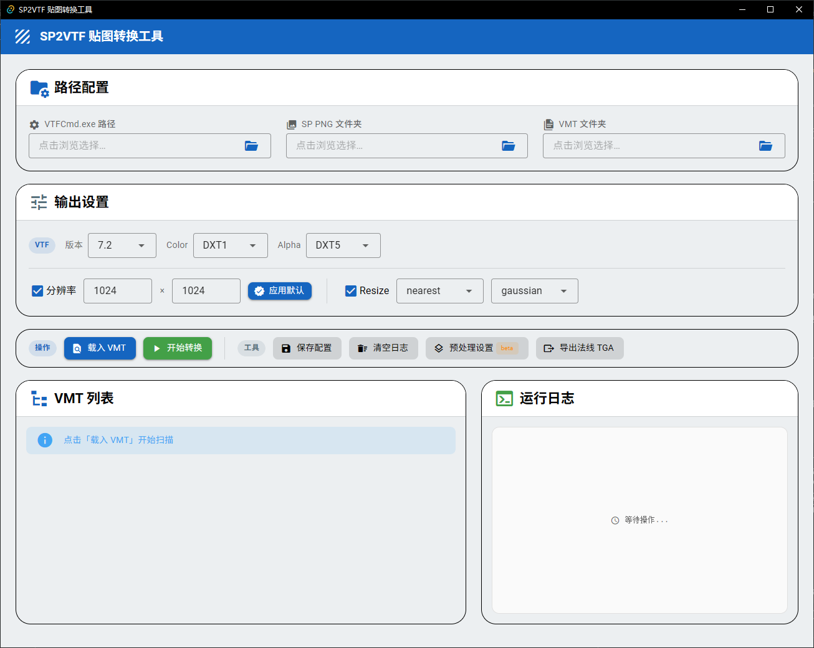

# SP2VTF - 贴图转换工具

[](https://www.gnu.org/licenses/gpl-3.0)
[](https://www.python.org/)
[](https://tauri.app/)
[](https://vuejs.org/)
[](https://vuetifyjs.com/)

一个专为 Source 引擎（如《求生之路2》）模组开发者设计的图形化辅助工具。
本工具可将 Substance Painter (SP) 导出的 PNG/TGA 贴图批量转换为 VTF 格式，并根据 VMT 文件所指向的路径，自动覆盖至目标 `materials` 目录中。

技术栈：**Tauri 2 + Vue 3 + Vuetify 4 + PyO3（内嵌 Python 3.10 + Pillow + NumPy）**，提供现代化的原生 GUI 与桌面分发体验。

## 核心特性

- **智能解析路径：** 自动解析 VMT 文件，根据 `$basetexture` / `$bumpmap` / `$phongexponenttexture` / `$envmapmask` 寻找对应的 PNG/TGA 贴图并就地替换。
- **预处理功能：** 内置 Alpha 通道生成（RGB → Gamma 2.2 灰度），支持输出黑白场裁切（Levels），一键生成夜光/透明度贴图。
- **丰富的导出选项：** 可自定义 VTF 版本及 Color / Alpha 通道格式（多达 26 种）。
- **灵活的尺寸控制：** 支持全局分辨率缩放（128 ~ 4096），在列表中双击即可单独修改某张贴图的目标尺寸；提供多种 Resize Method 与 Filter 算法。
- **一键批量设置：** 输出设置页新增「应用默认」按钮，把默认分辨率批量应用到所有已勾选项。
- **极简操作体验：** 全中文原生 GUI 界面，带彩色实时日志；路径与参数配置保存到 `config.json`，下次启动自动读取。
- **内嵌 Python：** 用户**无需预装 Python**，所有功能（含预处理）均在运行时内嵌的 Python 3.10 环境中完成。

## 界面预览



## 文件名约定

为了让工具能正确匹配，SP 导出的文件名必须严格遵循 `{VMT 文件名}_{贴图类型}.png` 的格式：

| SP 导出后缀 | VMT 参数映射 |
| :--- | :--- |
| `_Base_Color` | `$basetexture` |
| `_Normal_OpenGL` | `$bumpmap` |
| `_Roughness` | `$phongexponenttexture` |
| `_Metallic` | `$envmapmask` |

> **示例说明：**
> 假设你的 VMT 文件名为 `reciever_mk17_fn_scar_h_std_LOD0f.vmt`
> 那么对应的贴图应命名为：
> - `reciever_mk17_fn_scar_h_std_LOD0f_Base_Color.png`
> - `reciever_mk17_fn_scar_h_std_LOD0f_Normal_OpenGL.png`

> **建议：** 将 SP 导出的贴图文件夹与游戏 mod 路径分开管理，避免意外覆盖或混淆源文件和输出文件。

---

## 如何使用 (普通玩家/模组作者)

如果你只需要使用该工具进行转换，无需配置任何代码环境：

### 1. 准备工作
本工具底层依赖于 VTFLib 的核心组件，请务必先下载它：
- 下载并解压 [VTFCmd.exe](https://qualifing.lanzoum.com/iJJIT3pgau4j) 及其配套的 dll 文件。

### 2. 运行软件
1. 前往本仓库的 **Releases** 页面，下载最新版本：
   - **安装程序**：`SP2VTF_<版本>_x64-setup.exe`（写入 Program Files，带开始菜单/卸载项）
   - **绿色免安装**：`SP2VTF_<版本>_x64-portable.zip`（解压即用，双击 `sp2vtf-tauri.exe` 即运行）
2. 双击运行即可，**无需预装 Python**。

### 3. 操作流程
1. 在主界面填好四个核心路径：**VTFCmd.exe 所在路径**、**SP 导出的 PNG 文件夹**、**VMT 文件夹**、**游戏 materials 根目录**。
2. 点击 **载入 VMT**，左下方列表将列出所有 `.vmt` 文件，并自动标记可用状态。
3. 勾选需要转换的贴图（双击"分辨率"单元格可单独调整指定贴图的大小）。
4. 在右侧配置好你需要的 **VTF 输出参数** 和 **缩放设置**（点击「应用默认」可一键把默认分辨率应用到所有已勾选项）。
5. 点击 **开始转换**，在日志区查看实时处理结果。

---

## 本地开发与构建 (开发者)

### 环境准备
- Node.js（Tauri 2 需要较新版本）
- Rust 工具链（Rustup）
- [VTFCmd.exe](https://qualifing.lanzoum.com/iJJIT3pgau4j)
- 构建时通过 `PYO3_PYTHON` 指向本地 Python 3.10 用于 PyO3 交叉链接

### 运行源码
```bash
git clone https://github.com/ora233-fantaea/SP2VTF.git
cd SP2VTF/sp2vtf-tauri
npm install
$env:PYO3_PYTHON = "C:\Users\1\AppData\Local\Programs\Python\Python310\python.exe"
npm run tauri dev
```

### 打包发布
```powershell
$env:PYO3_PYTHON = "C:\Users\1\AppData\Local\Programs\Python\Python310\python.exe"
npm run tauri -- build
```

- 安装程序：`src-tauri/target/release/bundle/nsis/`（tauri 自动生成）
- 便携包：`src-tauri/target/release/bundle/portable/`（手动压缩，取 `target/release/` 下 `sp2vtf-tauri.exe` + 依赖 DLL + `resources/`）

> 注：tauri 官方 `bundle targets` 不支持 `zip`，便携包由 release 产物手动压缩生成，解压后需保持 `resources/python-embed` 相对 exe 的同级结构。

---

## 进阶：配置文件

程序运行并保存设置后会在同级目录自动生成 `config.json` 文件，路径与参数配置保存于此，下次启动自动读取。

---

## 发布工作流

- 推送 `v*` 标签触发 GitHub Actions 自动构建 NSIS 安装器 + 便携 zip，并上传到对应 GitHub Release。
- 示例：`git tag v1.0.8 && git push origin v1.0.8`

## 开源协议

本项目采用 [GPL-3.0 License](https://www.gnu.org/licenses/gpl-3.0) 协议开源。
允许任何个人或组织自由使用、修改和分发本项目的代码。如若衍生项目包含了本项目的代码，衍生项目同样必须以 GPLv3 协议开源。

注：本项目还在持续开发，如果你有建议，请发issue

## 更新日志

### v1.0.8
- 升级为 **Tauri 桌面版**，内嵌 Python 运行时，用户无需预装 Python。
- 新增 GitHub Actions 自动发布工作流：推送 `v*` 标签自动构建 NSIS 安装器 + 便携 zip 并上传 Release。
- **前端页面：**
  - 路径配置页：浏览选择 VTFCmd.exe 时只显示 `.exe` 可执行文件，并自动校验扩展名。
  - VMT 列表页：双击贴图行可直接编辑「基础贴图 / 法线贴图」的输出分辨率（128–4096）。
  - 输出设置页：新增「应用默认」按钮，一键把默认分辨率批量应用到所有已勾选项。
- 内嵌 Python 瘦身，减小安装包体积。

### v1.0.4
- 添加窗口图标
- 标题加入作者署名
- 增加预处理夜光提示

### v1.0.3
- 新增预处理对话框（Alpha 通道生成 + 黑白场裁切）
- 支持 TGA 格式输入
- 修复同目录 PNG/VTF 转换安全性问题

### v1.0.2
- 修复原子替换逻辑，防止转换失败时 VTF 丢失
- 新增文件对比对话框

### v1.0.1
- PySide6 Material Design 3 重写
- 首个发布版本
