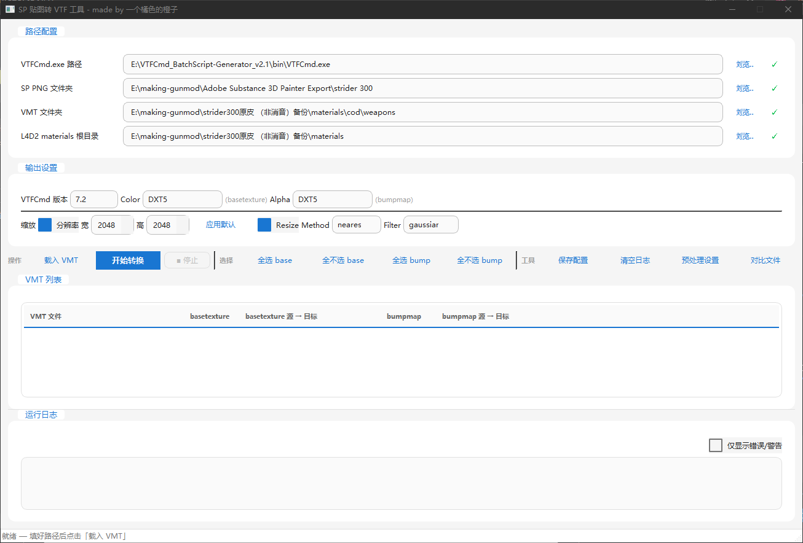

# SP2VTF - 贴图转换工具

[](https://www.gnu.org/licenses/gpl-3.0)
[](https://www.python.org/)
[](https://pypi.org/project/PySide6/)
[](https://pypi.org/project/Pillow/)
[](https://pypi.org/project/numpy/)

本项目使用 Opencode + DeepSeek V4 Pro 编写

一个专为 Source 引擎（如《求生之路2》）模组开发者设计的图形化辅助工具。
本工具可将 Substance Painter (SP) 导出的 PNG/TGA 贴图批量转换为 VTF 格式，并根据 VMT 文件所指向的路径，自动覆盖至目标 `materials` 目录中。采用 PySide6 结合 Material Design 3 风格开发，提供现代化的原生 GUI 体验。

## 核心特性

- **智能解析路径：** 自动解析 VMT 文件，根据 `$basetexture` / `$bumpmap` 寻找对应的 PNG/TGA 贴图并就地替换。
- **预处理功能（v1.0.3+）：** 内置 Alpha 通道生成（RGB → Gamma 2.2 灰度），支持输出黑白场裁切（Levels），一键生成夜光/透明度贴图。
- **丰富的导出选项：** 可自定义 VTF 版本（7.0 ~ 7.5）及 Color / Alpha 通道格式（多达 26 种）。
- **灵活的尺寸控制：** 支持全局分辨率缩放（128 ~ 4096），也支持在列表中双击单独修改某张贴图的目标尺寸；提供 3 种 Resize Method 和 14 种 Filter 算法。
- **极简操作体验：** 全中文原生 GUI 界面，带状态栏与彩色实时日志；支持一键保存路径与参数配置到本地。

## 界面预览



## 文件名约定

为了让工具能正确匹配，SP 导出的文件名必须严格遵循 `{VMT 文件名}_{贴图类型}.png` 的格式：

| SP 导出后缀 | VMT 参数映射 |
| :--- | :--- |
| `_Base_Color` | `$basetexture` |
| `_Normal_OpenGL` | `$bumpmap` |

> **示例说明：**
> 假设你的 VMT 文件名为 `reciever_mk17_fn_scar_h_std_LOD0f.vmt`
> 那么对应的贴图应命名为：
> - `reciever_mk17_fn_scar_h_std_LOD0f_Base_Color.png`
> - `reciever_mk17_fn_scar_h_std_LOD0f_Normal_OpenGL.png`

---

## 如何使用 (普通玩家/模组作者)

如果你只需要使用该工具进行转换，无需配置任何代码环境：

### 1. 准备工作
本工具底层依赖于 VTFLib 的核心组件，请务必先下载它：
- 下载并解压 [VTFCmd.exe](https://nemstools.github.io/pages/VTFLib-Download.html) 及其配套的 dll 文件。

### 2. 运行软件
1. 前往本仓库的 **Releases** 页面，下载最新版本的 `SP2VTF_v*.exe`。
2. 解压 `SP2VTF_v*.tar.gz` 得到 `.exe`，双击运行即可。

### 3. 操作流程
1. 在主界面填好四个核心路径：**VTFCmd.exe 所在路径**、**SP 导出的 PNG 文件夹**、**VMT 文件夹**、**游戏 materials 根目录**。
2. 点击 **载入 VMT**，左下方列表将列出所有 `.vmt` 文件，并自动标记可用状态。
3. 勾选需要转换的贴图（双击"分辨率"单元格可单独调整指定贴图的大小）。
4. 在右侧配置好你需要的 **VTF 输出参数** 和 **缩放设置**。
5. （可选）点击 **预处理设置** 配置 Alpha 通道参数。
6. 点击 **开始转换**，在日志区查看实时处理结果。

---

## 本地开发与构建 (开发者)

### 环境准备
- Python 3.10 或更高版本。
- 依赖：`pip install PySide6 Pillow numpy`
- [VTFCmd.exe](https://nemstools.github.io/pages/VTFLib-Download.html)

### 运行源码
```bash
git clone https://github.com/ora233-fantaea/SP2VTF.git
cd SP2VTF
python sp_to_vtf_v1.0.4.py
```

### 打包发布
使用 spec 文件打包（推荐，自动包含图标）：

```bash
pip install pyinstaller
pyinstaller SP2VTF_v1.0.4.spec
```

编译产物将生成在 `dist/` 目录下。

-----

## 进阶：配置文件与项目结构

首次运行并保存设置后，程序同级目录下会自动生成 `config.json` 文件：

```json
{
  "vtfcmd": "C:/tools/VTFCmd.exe",
  "png_dir": "...",
  "vmt_dir": "...",
  "materials_dir": "...",
  "size_enabled": true,
  "resize_enabled": true,
  "resize_width": 1024,
  "resize_height": 1024,
  "vtf_version": "7.2",
  "color_format": "DXT1",
  "alpha_format": "DXT5",
  "resize_method": "nearest",
  "resize_filter": "triangle",
  "preprocess_base": { ... },
  "preprocess_normal": { ... }
}
```

**项目结构概览：**

```text
.
├── sp_to_vtf_v1.0.4.py  # 核心源码（单文件）
├── tape-x64.png          # 程序图标
├── config.json           # 配置文件（程序运行时自动生成）
├── README.md             # 项目说明文档
└── CLAUDE.md             # AI 辅助开发上下文说明
```

## 开源协议

本项目采用 [GPL-3.0 License](https://www.gnu.org/licenses/gpl-3.0) 协议开源。
允许任何个人或组织自由使用、修改和分发本项目的代码。如若衍生项目包含了本项目的代码，衍生项目同样必须以 GPLv3 协议开源。

## 更新日志

### v1.0.4
- 添加窗口图标
- 标题加入作者署名
- 增加预处理夜光提示

### v1.0.3
- 新增预处理对话框（Alpha 通道生成 + 黑白场裁切）
- 支持 TGA 格式输入
- 修复同目录 PNG/VTF 转换安全性问题

### v1.0.2
- 修复原子替换逻辑，防止转换失败时 VTF 丢失
- 新增文件对比对话框

### v1.0.1
- PySide6 Material Design 3 重写
- 首个发布版本
